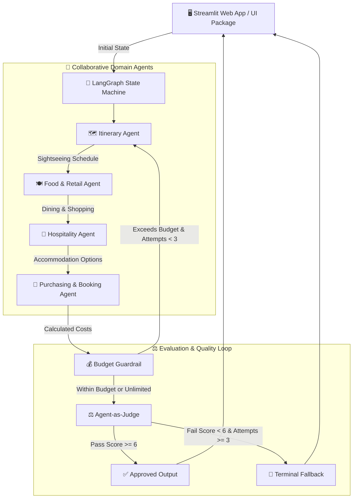

# 🌍 Travel Buddy — Multi-Agent AI Travel Planner

**Travel Buddy** is an intelligent, multi-agent AI travel planning platform powered by **LangGraph**, **LangChain**, **Google Gemini 3.1 Flash Lite**, and **Tavily Search**. It uses specialized domain agents working collaboratively to create persona-aligned, budget-verified, multi-day travel itineraries complete with real-time flight deals, hotel recommendations, day-by-day tabular schedules, interactive maps, and executable JSON state exports.

---

## 🏛️ Application Architecture & Execution Flow

Below is the high-level architecture diagram illustrating how user inputs flow through the Streamlit UI into the LangGraph state machine, invoking domain agents, budget guardrails, and persona compliance evaluators.



---

## 📂 Directory Structure & Module Guide

```text
aitravelbuddy/
├── app.py                     # Streamlit application router & main entry point (~150 lines)
├── requirements.txt           # Project Python dependencies
├── user_profile.json          # Local persistence for user persona & preference settings
├── .saved_trips.json          # Local fallback for saved trip plans and agent run states
├── README.md                  # System architecture & developer documentation
├── SPECIFICATION.md           # Authoritative system specification & technical reference
├── core/                      # Core business logic, agents, and graph definition
│   ├── __init__.py
│   ├── state.py               # Central TravelBuddyState TypedDict schema definition
│   ├── graph.py               # StateGraph compilation, node definitions, and routing logic
│   ├── agents.py              # Domain agents: Itinerary, Food, Hotel, Purchasing
│   ├── evaluation.py          # Budget guardrail, Agent-as-Judge, and terminal fallback
│   ├── personas.py            # Pre-configured persona profiles (Solo, Couple, Family, etc.)
│   ├── profile.py             # User profile JSON persistence & prompt context formatting
│   ├── surprise.py            # Seasonal destination pick & recommendation engine
│   ├── db.py                  # Supabase & local storage layer for saving trip states
│   ├── utils.py               # Location extraction, Pydeck geocoding, Excel export parser
│   └── logger.py              # In-memory session log buffer & troubleshooting logger
├── ui/                        # Modular Streamlit UI component package
│   ├── __init__.py
│   ├── styles.py              # Custom Light Mode CSS, typography, and badges
│   ├── sidebar.py             # Setup sidebar, group composition, dates, persona studio
│   ├── landing.py             # Guided Plan With Me Chatbot & Seasonal Inspiration tabs
│   └── plan_view.py           # Primary Action Bar, 5 plan tabs, maps, Q&A chat, exports
└── tests/                     # Automated unit test suite
    ├── __init__.py
    ├── test_db.py             # Unit tests for saving/loading trip states & profile data
    ├── test_evaluation.py     # Unit tests for agent-as-judge & quality failure handling
    ├── test_graph.py          # Unit tests for graph compilation & execution
    ├── test_guardrail.py      # Unit tests for budget guardrail routing
    ├── test_profile.py        # Unit tests for user profile JSON persistence
    ├── test_surprise.py       # Unit tests for seasonal pick recommendation engine
    └── test_utils.py          # Unit tests for location parser & geocoding helper
```

---

## 📊 Centralized Agent State Schema (`TravelBuddyState`)

The graph operates on a shared state defined in [`core/state.py`](file:///c:/claude/aitravelbuddy/core/state.py):

| Field | Type | Description |
| :--- | :--- | :--- |
| `origin` | `str` | Traveler source city (e.g. `"Singapore"`) |
| `destination` | `str` | Target destination (e.g. `"Kyoto, Japan"`) |
| `budget` | `float` | Total trip budget in SGD |
| `num_adults` / `num_children` | `int` | Traveler group composition |
| `travelers_summary` | `str` | Formatted summary (e.g. `"2 Adults, 1 Child"`) |
| `self_drive` | `bool` | Includes car rental, fuel, and tolls |
| `no_budget` | `bool` | Unlimited / flexible budget mode toggle |
| `dates` | `str` | Travel date string (e.g. `"Nov 15 - Nov 20, 2026"`) |
| `num_days` | `int` | Total calculated trip duration |
| `persona` | `str` | Active persona key (`"single"`, `"couple"`, `"family"`, `"custom"`) |
| `custom_persona_profile` | `dict` | Custom persona rules & preferences |
| `user_preferences` | `dict` | User dietary, lodging, pace, and interest preferences |
| `itinerary` | `str` | Day-by-day sightseeing markdown generated by Itinerary Agent |
| `food_and_retail` | `str` | Daily dining & shopping generated by Food & Retail Agent |
| `hotel_recommendations` | `str` | Hotel options generated by Hospitality Agent |
| `purchasing_guide` | `str` | Airfare, transport, and booking links generated by Purchasing Agent |
| `budget_breakdown` | `str` | Formatted cost summary & budget audit |
| `judge_verdict` | `str` | Rule-by-rule persona compliance report from Agent-as-Judge |
| `status` | `str` | Plan status (`"approved"`, `"unapproved"`, `"planning"`) |
| `quality_failure_reason` | `str` | Detailed failure reason when quality or budget criteria fail |

---

## 🚀 Running Locally & Test Execution

### 1. Install Dependencies
```powershell
pip install -r requirements.txt
```

### 2. Configure Environment Variables
Create a `.env` file or export your API keys:
```powershell
$env:GOOGLE_API_KEY="your-gemini-api-key"
$env:TAVILY_API_KEY="your-tavily-api-key"
$env:GOOGLE_MAPS_API_KEY="optional-google-maps-key"
```

### 3. Launch Streamlit Application
```powershell
streamlit run app.py
```

### 4. Run Automated Test Suite
```powershell
python -m unittest discover -s tests
```

---

## 🛠️ Contribution & Development Guidelines

1. **Adding a New Agent Node**:
   - Define the node function in [`core/agents.py`](file:///c:/claude/aitravelbuddy/core/agents.py).
   - Register the node in `build_graph()` inside [`core/graph.py`](file:///c:/claude/aitravelbuddy/core/graph.py).
   - Update `NODE_LABELS` in [`app.py`](file:///c:/claude/aitravelbuddy/app.py) for visual progress tracking.

2. **Modifying UI Components**:
   - Edit the specific UI component file under [`ui/`](file:///c:/claude/aitravelbuddy/ui/) rather than altering `app.py`.
   - Maintain light mode aesthetics with modern HSL/Hex color palettes and Inter typography.
