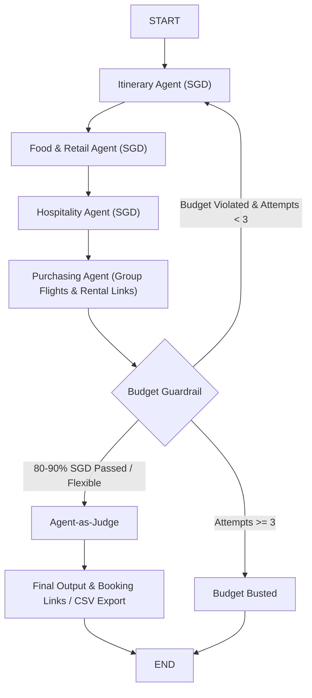

# 🌍 Travel Buddy — AI Multi-Agent Travel Planner

[](https://www.python.org/downloads/)
[](https://streamlit.io)
[](https://github.com/langchain-ai/langgraph)
[](LICENSE)

**Travel Buddy** is a production-grade, multi-agent travel planning web application built with **Streamlit**, **LangGraph**, **Google Gemini** (`gemini-3.1-flash-lite`), and **Supabase**. It coordinates four specialized AI agents to generate personalized travel itineraries, dining recommendations, hotel options, and round-trip airfare estimates. It features infinite budget default modes, custom persona builders, direct booking links, full itinerary location mapping, an interactive Q&A Chat Assistant, and Supabase integration to save and load past trips.

---

## 🌟 Key Features

- 💾 **Supabase Integration:** Save generated trip plans directly to a cloud database and instantly load them later, bypassing the LLM pipeline.
- ☀️ **Clean Light Mode UI:** Vibrant light theme (`#FFFFFF` background, `#F8FAFC` slate sidebar, `#0F172A` high-contrast typography).
- 📍 **Full Itinerary Location Mapping:** Automatically extracts and geocodes ALL day-by-day sightseeing venues, plotting interactive 3D pins for every activity on Pydeck & OpenStreetMap.
- 👥 **Group Composition Controls:** Customizable Adults (default: 2), Children >2 yrs (default: 1), and Infants <2 yrs (default: 0).
- 🛒 **Purchasing & Booking Agent:** Dedicated expert agent sourcing real flight prices, car rental rates, and generating direct clickable HTTPS booking links.
- 🚗 **Self-Drive Option (Car Rental):** Toggle self-drive mode to include car rental rates, fuel, and toll estimates in the trip budget.
- ♾️ **Flexible / No-Budget Default:** Unlimited budget mode active by default to focus on optimal experiences.
- 🛠️ **Custom Persona Builder:** Select from 5 built-in personas (including the new **Business Traveler**) or define your own custom persona rules.
- 💬 **Travel Assistant Q&A Chat:** Interactive follow-up chatbot tab using Gemini + Tavily search for packing tips, local advice, and travel questions.
- 📑 **Consolidated 5-Tab Interface:** Streamlined post-generation UX featuring "Trip Plan & Map", "Hotels & Dining", "Flights & Budget", "Travel Assistant", and "Under the Hood".
- 🤖 **4 Collaborative Agents:** Sequential generation pipeline with specialized agents for Sightseeing, Food & Retail, Hospitality, and Purchasing.

---

## 🏗️ Architecture & Graph Flow



*For detailed state schemas and constraint documentation, see [specifications.md](specifications.md).*

---

## 🗺️ How to Get a Google Maps API Key

1. Go to **[Google Cloud Console](https://console.cloud.google.com/)**.
2. Select or create a project.
3. Navigate to **APIs & Services > Library**, search for **Maps Embed API**, and click **Enable**.
4. Navigate to **APIs & Services > Credentials** -> Click **+ Create Credentials > API key**.
5. Copy your API key and set it in `.streamlit/secrets.toml` as `GOOGLE_MAPS_API_KEY` (or enter it in the app sidebar).

---

## 📁 Project Structure

```
aitravelbuddy/
├── .streamlit/
│   └── config.toml          # Light theme UI settings
├── core/
│   ├── __init__.py          # Core package init
│   ├── logger.py            # Troubleshooting logger & memory buffer
│   ├── state.py             # LangGraph TravelBuddyState schema (with num_adults, num_children, num_infants)
│   ├── personas.py          # Demographic profile definitions (Single, Couple, Family, Backpacker)
│   ├── utils.py             # Cost extraction, prompt formatting, DataFrame parser, extract_all_itinerary_locations
│   ├── agents.py            # Itinerary, Food/Retail, Hospitality, and Purchasing agent nodes
│   ├── evaluation.py        # Budget guardrail (with transport costs) & Agent-as-Judge nodes
│   └── graph.py             # StateGraph setup & conditional routing logic (8 nodes)
├── app.py                   # Streamlit web frontend in Light Mode (Full Location Maps, Q&A Chat, CSV)
├── requirements.txt         # Project dependencies
├── specifications.md        # Comprehensive technical specification
└── README.md                # Project documentation
```

---

## 🚀 Getting Started

### Prerequisites

- Python 3.10 or higher
- [Google Gemini API Key](https://aistudio.google.com/apikey)
- [Tavily Search API Key](https://tavily.com)
- Optional: [Google Maps Platform API Key](https://console.cloud.google.com/)

### Installation

1. **Clone the repository:**
   ```bash
   git clone https://github.com/yanchangchen/aitravelbuddy.git
   cd aitravelbuddy
   ```

2. **Create a virtual environment & install dependencies:**
   ```bash
   python -m venv venv
   source venv/bin/activate  # On Windows: venv\Scripts\activate
   pip install -r requirements.txt
   ```

3. **Configure Secrets (Optional):**
   Create `.streamlit/secrets.toml`:
   ```toml
   GOOGLE_API_KEY = "your-gemini-key"
   TAVILY_API_KEY = "your-tavily-key"
   GOOGLE_MAPS_API_KEY = "your-gmaps-key"
   ```

4. **Launch the Streamlit app:**
   ```bash
   streamlit run app.py
   ```

---

## 📄 License

Distributed under the MIT License. See `LICENSE` for more information.
