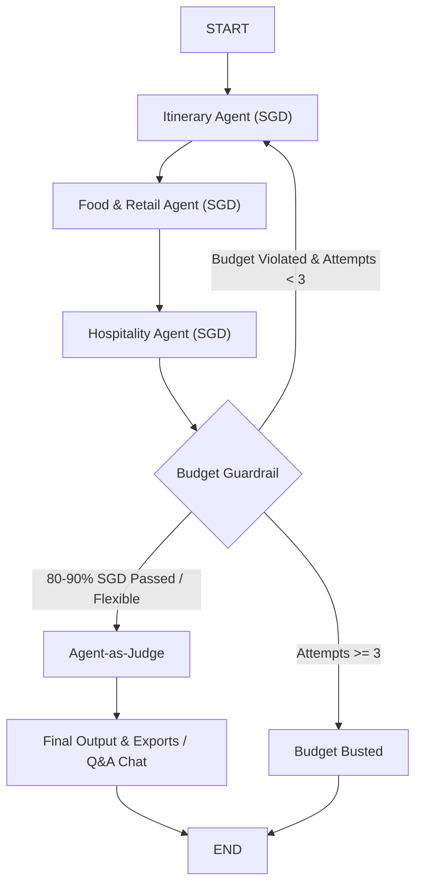

# 🌍 Travel Buddy — AI Multi-Agent Travel Planner

[](https://www.python.org/downloads/)
[](https://streamlit.io)
[](https://github.com/langchain-ai/langgraph)
[](LICENSE)

**Travel Buddy** is a production-grade, multi-agent travel planning web application built with **Streamlit**, **LangGraph**, and **Google Gemini** (`gemini-3.1-flash-lite`). It coordinates three specialized AI agents to generate personalized 5-day travel itineraries, dining recommendations, and hotel options in **Singapore Dollars (SGD / S$)** (with infinite budget by default), custom persona builders, Google Maps visualizers, and an interactive Q&A Chat Assistant.

---

## 🌟 Key Features

- 🔑 **Streamlit Secrets Integration:** Automatically reads `GOOGLE_API_KEY`, `TAVILY_API_KEY`, and optional `GOOGLE_MAPS_API_KEY` directly from `st.secrets`.
- 🇸🇬 **Default SGD Currency (S$) & 5-Day Default:** Calculates all itinerary, dining, and hotel costs in Singapore Dollars for 5-day trips.
- ♾️ **Flexible / No-Budget Default:** Unlimited budget mode active by default to focus on optimal experiences.
- 🛠️ **Custom Persona Builder:** Select from 4 built-in personas or define your own custom persona rules, tempo, mobility, dining, and lodging preferences.
- 💬 **Travel Assistant Q&A Chat:** Interactive follow-up chatbot tab using Gemini + Tavily search for packing tips, local advice, and travel questions.
- 📍 **Google Maps Location Visualizer:** Embedded interactive Google Maps for destination attractions with step-by-step API key setup instructions.
- 📊 **Tabular Itinerary & CSV Export:** Displays itineraries as structured data tables and enables one-click **CSV**, **Full Text (.txt)**, and **Debug Log (.log)** downloads.
- 🤖 **Multi-Agent Collaboration:** Sequential generation pipeline with specialized agents for Sightseeing, Food & Retail, and Hospitality.
- 💰 **Deterministic Budget Guardrail:** Hard-coded Python cost parsing ensuring total estimated trip cost lands strictly within **80%–90%** of the target budget with a 3-strike retry loop.
- ⚖️ **Cognitive Agent-as-Judge:** Automated quality evaluation inspecting outputs against persona-specific mandatory constraints.

---

## 🏗️ Architecture & Graph Flow



*For detailed state schemas and constraint documentation, see [specifications.md](specifications.md).*

---

## 🗺️ How to Get a Google Maps API Key

1. Go to **[Google Cloud Console](https://console.cloud.google.com/)**.
2. Select or create a project.
3. Navigate to **APIs & Services > Library**, search for **Maps Embed API**, and click **Enable**.
4. Navigate to **APIs & Services > Credentials** -> Click **+ Create Credentials > API key**.
5. Copy your API key and set it in `.streamlit/secrets.toml` as `GOOGLE_MAPS_API_KEY` (or enter it in the app sidebar).

---

## 📁 Project Structure

```
aitravelbuddy/
├── .streamlit/
│   └── config.toml          # Dark theme UI settings
├── core/
│   ├── __init__.py          # Core package init
│   ├── logger.py            # Troubleshooting logger & memory buffer
│   ├── state.py             # LangGraph TravelBuddyState schema (with SGD, no_budget & custom persona)
│   ├── personas.py          # Demographic profile definitions (Single, Couple, Family, Backpacker)
│   ├── utils.py             # Cost extraction, prompt formatting, DataFrame parser, text export
│   ├── agents.py            # Itinerary, Food/Retail, and Hospitality agent nodes (SGD + logging)
│   ├── evaluation.py        # Budget guardrail & Agent-as-Judge nodes (logging)
│   └── graph.py             # StateGraph setup & conditional routing logic
├── app.py                   # Streamlit web frontend (Custom Persona, Q&A Chat, Maps, CSV export)
├── requirements.txt         # Project dependencies
├── specifications.md        # Comprehensive technical specification
└── README.md                # Project documentation
```

---

## 🚀 Getting Started

### Prerequisites

- Python 3.10 or higher
- [Google Gemini API Key](https://aistudio.google.com/apikey)
- [Tavily Search API Key](https://tavily.com)
- Optional: [Google Maps Platform API Key](https://console.cloud.google.com/)

### Installation

1. **Clone the repository:**
   ```bash
   git clone https://github.com/yanchangchen/aitravelbuddy.git
   cd aitravelbuddy
   ```

2. **Create a virtual environment & install dependencies:**
   ```bash
   python -m venv venv
   source venv/bin/activate  # On Windows: venv\Scripts\activate
   pip install -r requirements.txt
   ```

3. **Configure Secrets (Optional):**
   Create `.streamlit/secrets.toml`:
   ```toml
   GOOGLE_API_KEY = "your-gemini-key"
   TAVILY_API_KEY = "your-tavily-key"
   GOOGLE_MAPS_API_KEY = "your-gmaps-key"
   ```

4. **Launch the Streamlit app:**
   ```bash
   streamlit run app.py
   ```

---

## 📄 License

Distributed under the MIT License. See `LICENSE` for more information.
