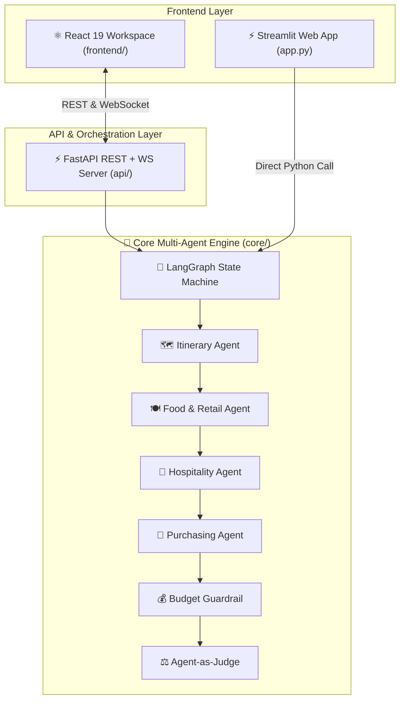

# 🌍 Travel Buddy — Multi-Agent AI Travel Planner

**Travel Buddy** is an intelligent, multi-agent AI travel planning platform powered by **LangGraph**, **LangChain**, **Google Gemini 3.1 Flash Lite**, and **Tavily Search**. It uses specialized domain agents working collaboratively to create persona-aligned, budget-verified, multi-day travel itineraries complete with real-time flight deals, hotel recommendations, day-by-day tabular schedules, interactive maps, and executable JSON state exports.

---

## 🏛️ Dual Application Architecture

Travel Buddy supports **two frontend choices** sharing the exact same Python multi-agent backend engine (`core/`):

1. **🎨 "The Traveler's Desk" (Modern React + FastAPI Stack)**
   - **Frontend**: Vite + React 19 + Zustand + Framer Motion + Leaflet maps (lives in `frontend/`)
   - **Backend**: FastAPI REST & WebSocket streaming server (lives in `api/`)
   - **Features**: 3-pane studio workspace with zero page reruns, instant interactive timeline editing, Leaflet maps, and real-time agent execution stream.

2. **⚡ Streamlit Web Application (Classic Stack)**
   - **Framework**: Streamlit (`app.py` + `ui/` package)
   - **Features**: Rapid python-only web app with progress spinners, tabbed views, and built-in interactive PyDeck charts.


```mermaid
graph TD
    subgraph "Frontend Layer"
        ReactApp["⚛️ React 19 Workspace (frontend/)"]
        StreamlitApp["⚡ Streamlit Web App (app.py)"]
    end

    subgraph "API & Orchestration Layer"
        API["⚡ FastAPI REST + WS Server (api/)"]
    end

    subgraph "🤖 Core Multi-Agent Engine (core/)"
        SG["🔄 LangGraph State Machine"]
        Node1["🗺️ Itinerary Agent"]
        Node2["🍽️ Food & Retail Agent"]
        Node3["🏨 Hospitality Agent"]
        Node4["🛒 Purchasing Agent"]
        Guard["💰 Budget Guardrail"]
        Judge["⚖️ Agent-as-Judge"]
    end

    ReactApp <-->|REST & WebSocket| API
    API --> SG
    StreamlitApp -->|Direct Python Call| SG

    SG --> Node1 --> Node2 --> Node3 --> Node4 --> Guard --> Judge
```

---

## 📂 Directory Structure & Module Guide

```text
aitravelbuddy/
├── app.py                     # Streamlit router & main entry point
├── requirements.txt           # Python dependencies (includes FastAPI & Uvicorn)
├── core/                      # Shared multi-agent engine (UNCHANGED)
│   ├── state.py               # TravelBuddyState TypedDict schema
│   ├── graph.py               # StateGraph compilation & routing
│   ├── agents.py              # Itinerary, Food, Hotel, Purchasing agents
│   ├── evaluation.py          # Budget guardrail & Agent-as-Judge
│   ├── personas.py            # Pre-configured persona profiles
│   ├── profile.py             # User profile JSON persistence
│   ├── surprise.py            # Seasonal picks recommendation engine
│   ├── db.py                  # Supabase & local JSON storage
│   └── utils.py               # Geocoding, parsing & formatting
├── api/                       # FastAPI Backend Layer
│   ├── main.py                # FastAPI entry point & CORS
│   └── routes/                # REST & WebSocket route handlers
│       ├── trips.py           # Plan execution, saved trips, export
│       ├── stream.py          # WebSocket live agent execution stream
│       ├── profiles.py        # User profile CRUD
│       ├── surprise.py        # Seasonal packages API
│       └── concierge.py       # AI chat concierge & plan extractor
├── frontend/                  # React Frontend ("The Traveler's Desk")
│   ├── index.html
│   ├── vite.config.js
│   ├── package.json
│   ├── playwright.config.js   # E2E test configuration
│   ├── src/
│   │   ├── pages/             # LandingPage, DeskPage (3-pane workspace)
│   │   ├── components/        # LeftDrawer, CenterCanvas, RightPanel
│   │   ├── stores/            # Zustand state management (tripStore)
│   │   ├── api/               # REST client & WebSocket streaming API
│   │   └── styles/            # CSS tokens, layout grid & animations
│   └── e2e/                   # Playwright E2E UX test suite
├── ui/                        # Streamlit UI package
└── tests/                     # Python unittest suite (35 tests)
```

---

## 🚀 Local Development & Execution Guide

### Option A: Run the React + FastAPI "Traveler's Desk" (Recommended)

1. **Install Python & Node Dependencies**:
   ```powershell
   pip install -r requirements.txt
   cd frontend; npm install; cd ..
   ```

2. **Start FastAPI Backend Server** (Port 8000):
   ```powershell
   uvicorn api.main:app --reload --port 8000
   ```

3. **Start React Vite Dev Server** (Port 5173):
   ```powershell
   cd frontend
   npm run dev
   ```

4. Open `http://localhost:5173` in your browser.

---

### Option B: Run the Streamlit Application

```powershell
streamlit run app.py
```

---

## 🧪 Testing Suite

### 1. Python Unit Tests (35 Tests)
```powershell
python -m unittest discover -s tests
```

### 2. Playwright E2E UX Tests (React App)
```powershell
cd frontend
npm run test:e2e
```

---

## ☁️ Deployment Guide (Free Tier)

- **Frontend (React)**: Deploy `frontend/` to **Vercel** (Free Hobby Tier).
- **Backend (FastAPI)**: Deploy root directory to **Render** as a Python Web Service (`uvicorn api.main:app --host 0.0.0.0 --port $PORT`).
- **Map Tiles**: OpenStreetMap via Leaflet (zero API key required).

