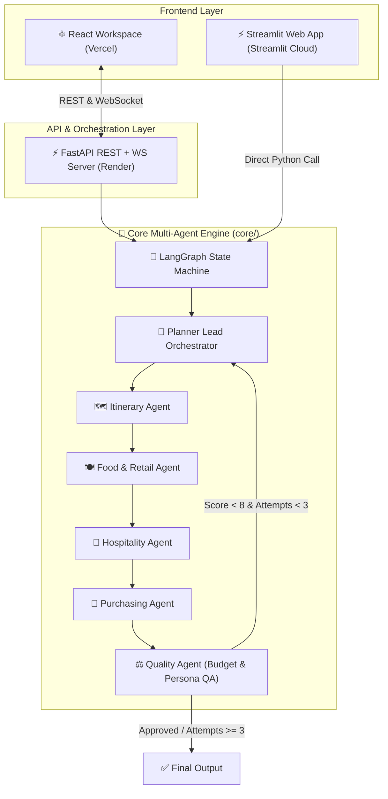

# 🌍 Travel Buddy — Multi-Agent AI Travel Planner

**Travel Buddy** is an intelligent, multi-agent AI travel planning platform powered by **LangGraph**, **LangChain**, **Google Gemini 3.1 Flash Lite**, and **Tavily Search**. It uses specialized domain agents working collaboratively to create persona-aligned, budget-verified travel itineraries complete with real-time flight deals, hotel recommendations, day-by-day tabular schedules, interactive Google Maps, and executable JSON state exports.

---

## 🏛️ Dual Application Architecture

Travel Buddy supports **two frontend choices** sharing the exact same Python multi-agent backend engine (`core/`):

1. **🎨 "The Traveler's Desk" (Modern React + FastAPI Stack)**
   - **Production App**: [https://aitravelbu88y.vercel.app/](https://aitravelbu88y.vercel.app/)
   - **Frontend**: Vite + React + Zustand + Framer Motion (lives in `frontend/`)
   - **Backend**: FastAPI REST & WebSocket streaming server on Render (lives in `api/`)
   - **Features**: 3-pane studio workspace with zero page reruns, interactive timeline editing, Google Maps itinerary explorer, rich hotel cards, and real-time agent execution stream.

2. **⚡ Streamlit Web Application (Classic Stack)**
   - **Production App**: [https://aitripbuddy.streamlit.app/](https://aitripbuddy.streamlit.app/)
   - **Framework**: Streamlit (`app.py` + `ui/` package)
   - **Features**: Python-only web app with progress spinners, tabbed views, full-width Google Maps, and Excel itinerary downloads.


```mermaid
graph TD
    subgraph "Frontend Layer"
        ReactApp["⚛️ React Workspace (Vercel)"]
        StreamlitApp["⚡ Streamlit Web App (Streamlit Cloud)"]
    end

    subgraph "API & Orchestration Layer"
        API["⚡ FastAPI REST + WS Server (Render)"]
    end

    subgraph "🤖 Core Multi-Agent Engine (core/)"
        SG["🔄 LangGraph State Machine"]
        Node0["👑 Planner Lead Orchestrator"]
        Node1["🗺️ Itinerary Agent"]
        Node2["🍽️ Food & Retail Agent"]
        Node3["🏨 Hospitality Agent"]
        Node4["🛒 Purchasing Agent"]
        Quality["⚖️ Quality Agent (Budget & Persona QA)"]
    end

    ReactApp <-->|REST & WebSocket| API
    API --> SG
    StreamlitApp -->|Direct Python Call| SG

    SG --> Node0 --> Node1 --> Node2 --> Node3 --> Node4 --> Quality
    Quality -->|Score < 8 & Attempts < 3| Node0
    Quality -->|Approved / Attempts >= 3| Final["✅ Final Output"]
```

---

## 📂 Directory Structure & Module Guide

```text
aitravelbuddy/
├── app.py                     # Streamlit router & main entry point
├── requirements.txt           # Python dependencies (includes FastAPI & Uvicorn)
├── architecture.md            # System architecture and agent design
├── design.md                  # UI/UX design tokens and component specs
├── specifications.md          # Multi-agent system specifications
├── core/                      # Shared multi-agent engine
│   ├── state.py               # TravelBuddyState TypedDict schema
│   ├── graph.py               # StateGraph compilation & routing
│   ├── agents.py              # Itinerary, Food, Hotel, Purchasing agents
│   ├── evaluation.py          # Unified Quality Agent (Budget & QA)
│   ├── personas.py            # Pre-configured persona profiles
│   ├── profile.py             # User profile JSON persistence
│   ├── surprise.py            # Seasonal picks recommendation engine
│   ├── db.py                  # Supabase & local JSON storage
│   └── utils.py               # Geocoding, parsing & formatting
├── api/                       # FastAPI Backend Layer
│   ├── main.py                # FastAPI entry point & CORS
│   └── routes/                # REST & WebSocket route handlers
│       ├── trips.py           # Plan execution, saved trips, export
│       ├── stream.py          # WebSocket live agent execution stream
│       ├── profiles.py        # User profile CRUD
│       ├── surprise.py        # Seasonal packages API
│       └── concierge.py       # AI chat concierge & plan extractor
├── frontend/                  # React Frontend ("The Traveler's Desk")
│   ├── src/
│   │   ├── pages/             # LandingPage, DeskPage (3-pane workspace)
│   │   ├── components/        # CenterCanvas, RightPanel, LeftDrawer
│   │   ├── stores/            # Zustand state management (tripStore)
│   │   ├── api/               # REST client & WebSocket streaming API
│   │   └── styles/            # CSS tokens, layout grid & animations
│   └── e2e/                   # Playwright E2E UX test suite
├── ui/                        # Streamlit UI package
└── tests/                     # Full pytest test suite (44 tests)
```

---

## 🚀 Local Development & Execution Guide

### Option A: Run the React + FastAPI "Traveler's Desk" (Recommended)

1. **Install Python & Node Dependencies**:
   ```powershell
   pip install -r requirements.txt
   cd frontend; npm install; cd ..
   ```

2. **Start the FastAPI Backend**:
   ```powershell
   uvicorn api.main:app --host 0.0.0.0 --port 8000 --reload
   ```

3. **Start the Vite React Frontend**:
   ```powershell
   cd frontend
   npm run dev
   ```

### Option B: Run the Streamlit Application

```powershell
streamlit run app.py
```

---

## 🧪 Testing & Validation

Run the automated test suite:
```powershell
pytest
```
*Current test suite: **44 passed** (`100% pass rate`).*
