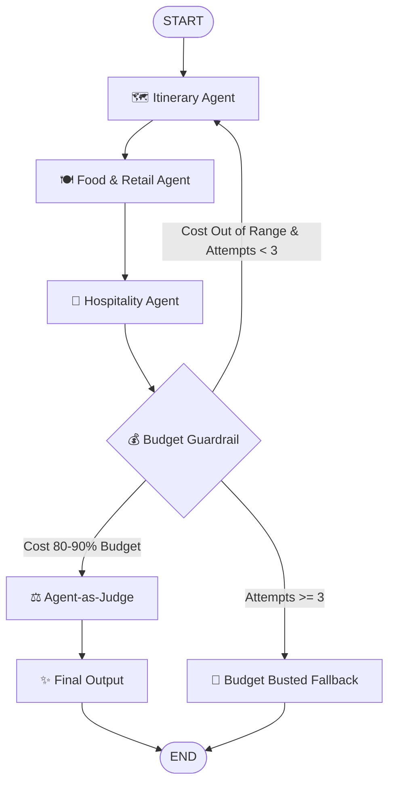

# Travel Buddy — System Specifications & Architecture

## 1. Overview
**Travel Buddy** is an advanced multi-agent travel planning system built with **LangGraph** and **Google Gemini** (`gemini-3.1-flash-lite`). It orchestrates three specialized planning agents to create persona-aware travel itineraries backed by real-time web research via Tavily. The system features a dual-layer evaluation engine combining deterministic Python budget guardrails with a cognitive LLM-as-a-Judge quality check.

---

## 2. Technical Stack & Core Framework
- **Orchestration:** LangGraph (`StateGraph`) using a centralized `TypedDict` state.
- **LLM Layer:** `ChatGoogleGenerativeAI` (`gemini-3.1-flash-lite`).
- **Search Tooling:** `TavilySearchResults` bound directly to planning nodes for real-time web research.
- **Frontend / Deployment:** Streamlit application (`app.py`).

---

## 3. Multi-Agent Pipeline & Nodes

The system consists of three specialized generation nodes and a dual-layer evaluation process:

### 3.1 Planning Agents
1. **Itinerary Agent (`itinerary_agent`):**
   - Researches top attractions and activities using real-time search.
   - Generates a day-by-day sightseeing plan with estimated costs and geographic clustering.
   - Allocates ~25–30% of total budget.
   - Outputs `SIGHTSEEING_TOTAL_USD: [number]` at the end.

2. **Food & Retail Agent (`food_retail_agent`):**
   - Reads the itinerary's daily activity zones to ensure geographic proximity.
   - Recommends real-world breakfast, lunch, dinner, and shopping spots matching the user's persona.
   - Allocates ~30–35% of total budget.
   - Outputs `FOOD_RETAIL_TOTAL_USD: [number]` at the end.

3. **Hospitality Agent (`hospitality_agent`):**
   - Sources 3 distinct hotel/accommodation options (at varied price points) convenient to activity zones.
   - Recommends one primary option matching persona and budget constraints.
   - Allocates ~35–40% of total budget.
   - Outputs `HOTEL_TOTAL_USD: [number]` at the end.

---

## 4. Dual-Layer Evaluation Engine

### Layer 1: Deterministic Budget Guardrail (`budget_guardrail`)
- Pure Python calculation (no LLM reasoning overhead).
- Parses numeric totals output by each planning node using regex (`LABEL_TOTAL_USD: amount`).
- **Target Range:** Total estimated cost must land strictly within **80% to 90%** of the user's budget (providing a 10-20% under-budget safety buffer).
- **Retry Loop & Strike-Three Rule:**
  - If total cost < 80% or > 90%, increments `budget_attempts`.
  - Appends actionable feedback to `critique_history` (via `operator.add`) and routes back to `itinerary_agent`.
  - If `budget_attempts >= 3` and budget is still violated, routes immediately to terminal fallback `budget_busted_fallback` setting `status = 'budget_busted'`.

### Layer 2: Cognitive Agent-as-Judge (`agent_as_judge`)
- Runs **only** after the deterministic budget check passes (`status == 'budget_passed'`).
- Prompts an independent LLM call acting as an impartial quality inspector.
- Audits the plan against all mandatory persona rules.
- Outputs `VERDICT: [PASS/FAIL]`, `SCORE: [1-10]`, a rule-by-rule checklist with evidence, and an overall assessment.

---

## 5. State Schema (`TravelBuddyState`)

```python
class TravelBuddyState(TypedDict):
    destination: str           # Target city/region (e.g., "Tokyo, Japan")
    budget: float              # Total trip budget in USD
    dates: str                 # Date range string
    persona: str               # "single" | "couple" | "family"
    itinerary: str             # Generated sightseeing output
    food_and_retail: str       # Generated dining/shopping output
    hotel_recommendations: str # Generated lodging output
    budget_breakdown: str      # Calculated financial report
    budget_attempts: int       # Iteration counter (max 3)
    critique_history: Annotated[list[str], operator.add] # Accumulated feedback
    status: str                # "planning" | "budget_passed" | "approved" | "budget_busted"
    judge_verdict: str         # LLM-as-a-Judge report
```

---

## 6. Persona Profiles & Behavioral Constraints

1. **Solo Traveler (`single`):**
   - High tempo (4-6 activities/day), high mobility (public transit/walking).
   - Budget street food/markets (<$15/meal), hostels/capsule hotels.
   - Nightlife, hidden gems, and daily social activities included.

2. **Couple's Getaway (`couple`):**
   - Medium tempo (2-4 activities/day), relaxed mornings (no activities before 9:30 AM).
   - Curated dining, rooftop bars, scenic views, aesthetic cafes.
   - Boutique hotels / mid-to-high comfort B&Bs; wraps up by 10:30 PM.

3. **Family Adventure (`family`):**
   - Low tempo (2-3 activities/day max), stroller accessible, minimal walking.
   - Rest/snack stops every 2 hours; kid-friendly dining.
   - Early nights mandatory (no activities after 7:30 PM, no adult venues).

---

## 7. Graph Topology & Conditional Routing


